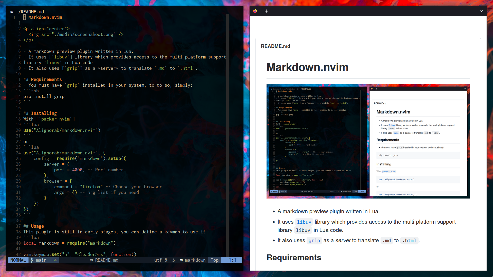

# Markdown.nvim

<p align="center">
  
</p>

- A markdown preview plugin written in Lua.
- It uses [`luv`] library which provides access to the multi-platform support
library [`libuv`] in Lua code.
- It also uses [`grip`] as a *server* to translate `.md` to `.html`.

## Requirements
- You must have [`grip`] installed in your system, to do so, simply:
```zsh
pip install grip
```
- [`luasocket`], you can install it by running:
```zsh
git clone https://github.com/lunarmodules/luasocket.git
cd luasocket
make
sudo make install
```

## Installing
With [`packer.nvim`]
```lua
use("Alighorab/markdown.nvim")
```
or
```lua
use("Alighorab/markdown.nvim", {
    config = require("markdown").setup({
        server = {
            port = "4000", -- Port number
        },
        browser = {
            command = "firefox" -- Choose your browser
            args = {} -- arg list if you need
        }
    })
})
```

## Options
Default options are:
```lua
require("markdown").setup({
    server = {
        enable = true,
        port = "${port}", -- Choose port automatically (recommended) or can be any free port
    },
    browser = {
        command = "firefox",
        args = {}, -- comma-separated string, e.g., { "-P", "Markdown", "--new-instance" }
    }
})
```

## Usage
This plugin is still in early stages, you can define a keymap to use it
```lua
local markdown = require("markdown")

vim.keymap.set("n", "<leader>ms", function()
    markdown.spawn_server()
    markdown.spawn_browser()
end)

vim.keymap.set("n", "<leader>mk", function()
    markdown.kill_server()
    markdown.kill_browser()
end)
```
I still prefer not to launch browser on opening any markdown but it will be an
option soon.

## TODO
- [x] Close server and browser on buffer close
- [x] Ability to choose free port automatically
- [ ] Add autostart option
- [ ] See changes at realtime without saving
- [ ] Syncronize scrolling


[`luv`]: https://github.com/luvit/luv.git
[`libuv`]: https://github.com/libuv/libuv
[`grip`]: https://github.com/joeyespo/grip
[`packer.nvim`]: https://github.com/wbthomason/packer.nvim
[`luasocket`]: https://github.com/lunarmodules/luasocket.git
